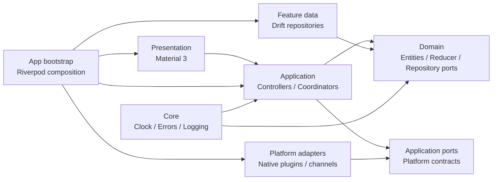

# RestEye（眸息）系统架构与开发规范

## 1. 项目目的与文档优先级

RestEye 是一个本地优先的 20-20-20 护眼提醒工具：默认工作 20 分钟、休息 20 秒，支持自定义工作/休息时长、未休息与未工作重复提醒、双向超时处理、系统通知动作、锁屏暂停，以及工作时长、休息时长和次数统计。目标平台是 Android、Windows 和 macOS；三端共享 Flutter 业务代码、状态规则和 Material 3 界面，系统通知、屏幕状态和生命周期通过原生适配层接入。

本项目没有账号、网络同步或云端数据，用户数据默认只保存在本机 SQLite。产品行为以 `docs/requirements.md` 为准；代码组织、依赖方向和实现约束以本文档为准；根目录 `AGENTS.md` 是给贡献者和后续 AI 的快速执行摘要。开始修改前必须先阅读 `AGENTS.md`、本文档和需求文档。

## 2. 技术基线与依赖

当前基线为 Flutter 3.47.2、Dart 3.13.2，`pubspec.yaml` 的 SDK 约束为 `^3.13.2`。Android `minSdk` 为 24，`compileSdk`/`targetSdk` 统一为 36。Windows 主机只构建 Android 和 Windows；macOS 构建暂缓。macOS 主机可以构建 macOS，Windows 构建可暂缓。

| 依赖 | 用途 | 规则 |
| --- | --- | --- |
| Flutter Material 3、`flutter_localizations` | 跨平台 UI、主题和官方本地化 | 优先官方组件，不为每个平台复制视觉系统 |
| `flutter_riverpod` 3.0 | Provider 装配和展示状态订阅 | 只在 application/presentation/app 装配层使用 |
| `drift`、`drift_flutter` | SQLite schema、事务、迁移和查询 | 通过 repository 暴露，禁止泄漏 Drift 行对象 |
| `flutter_local_notifications` 22.3.0、`timezone` | Android/Windows/macOS 原生通知和时区调度 | 只能由 notification gateway 包装 |
| `package_info_plus` | 关于页读取当前平台应用版本 | 仅在 presentation 的版本展示处使用，不将版本号硬编码在 Dart UI 中 |
| `intl`、Flutter `gen_l10n` | 文案、日期、时长和复数格式化 | 用户可见文本不得硬编码 |
| `build_runner`、`drift_dev`、`flutter_lints` | 生成代码和开发检查 | 仅用于开发，不引入测试框架 |

新增依赖必须说明用途、三端支持、维护状态、许可证、替代方案和体积/复杂度代价。领域层不得依赖任何第三方类型；平台插件不得越过 gateway 进入业务层。

## 3. 总体架构与依赖方向

采用单 Flutter package 的 **feature-first + 分层架构**。依赖方向必须指向领域抽象，具体实现由 bootstrap 组合：



`app/bootstrap` 可以依赖所有具体实现，但不能承载业务规则。`presentation` 不得直接访问数据库、插件或平台通道；`domain` 不得反向依赖 application、data、presentation、Flutter、Riverpod、Drift 或原生代码；`core` 不得依赖任何 feature。跨 feature 协作使用公开的 domain/application 接口，不得直接访问其他 feature 的内部文件。

## 4. 当前目录结构

```text
lib/
├── main.dart                         # 仅启动 bootstrap
├── app/
│   ├── bootstrap/                    # 运行时资源装配和生命周期
│   ├── navigation/                   # 顶层导航与页面壳
│   ├── theme/                        # Material 3 主题、间距
│   └── rest_eye_app.dart             # MaterialApp 配置
├── core/
│   ├── clock/                        # AppClock、系统时钟
│   ├── error/                        # AppFailure 及错误分类
│   ├── lifecycle/                    # 可等待的应用退出契约
│   └── logging/                      # AppLogger
├── features/
│   ├── timer/{domain,application,data,presentation}/
│   ├── settings/{domain,application,data,presentation}/
│   ├── statistics/{domain,application,data,presentation}/
│   └── about/presentation/
├── infrastructure/database/          # AppDatabase、tables、生成的 Drift 文件
├── platform/                         # 通知、生命周期、屏幕状态、窗口行为实现
└── l10n/{arb,generated}/             # ARB 源文件和生成文件
```

Android 原生代码位于 `android/`，Windows runner、屏幕状态桥接和系统托盘位于 `windows/runner/`，macOS runner、菜单栏状态项和 Swift 屏幕状态桥接位于 `macos/Runner/`。窗口行为通过 `WindowBehaviorGateway` 隔离；不要在页面或业务层直接调用 Win32 或 AppKit API。

## 5. 各层职责

### 5.1 App 与 Bootstrap

`main.dart` 只负责调用 `bootstrap()`。bootstrap 创建数据库、repositories、clock、notification gateway、screen-state gateway、dispatcher 和 runtime，并通过 Riverpod Provider overrides 注入；它不处理按钮逻辑、计时规则或翻译文案。`AppRuntime` 统一拥有并按顺序释放订阅、计时器、通知、平台桥接和数据库资源；释放必须可等待、幂等，重复调用必须等待同一个清理 Future，单个组件失败不能阻断其余清理。`AppExitGateway` 将原生真正退出请求桥接到这条清理链，原生宿主必须等清理完成后再结束进程。

### 5.2 Core

只放跨 feature 且稳定的基础能力：`AppClock` 同时提供 UTC 墙上时间和进程内单调 elapsed 时间；`AppFailure` 区分校验、持久化、权限、平台和未知错误；`AppLogger` 是日志抽象。禁止添加只被一个 feature 使用的业务模型，也禁止创建无边界的 `utils.dart`/`helpers.dart`。

### 5.3 Domain

领域模型必须是纯 Dart、不可变、可序列化且可独立推理。计时规则由 `TimerReducer`、`TimerSnapshot`、`TimerCommand`、`TimerEvent` 和 `TimerTransition` 表达；repository interface 和平台 port 只定义抽象契约。非法配置在入口拒绝，枚举持久化使用稳定字符串，不使用 ordinal。领域层不执行通知、写库、启动 Timer 或读取 Flutter 生命周期。

从持久化读取的配置类未知枚举（主题、语言、超时处理）可以安全回退到默认值，并保留其他设置；回退必须集中在 mapper/repository 边界，不能把未知值传播到领域层。计时快照中的未知枚举、缺失必需字段或不满足不变量的数据仍属于不可恢复输入，应进入独立失败页且不得清空数据库。

### 5.4 Application

应用层编排用例和副作用：`TimerCommandDispatcher` 串行执行所有计时变更；`TimerRuntime` 负责 deadline reconciliation 和显示 tick（只有活动计时运行显示计时器）；`NotificationScheduleReconciler` 将快照转换为幂等通知计划，并通过内部队列按最新 generation 收敛；`NotificationActionCoordinator` 将通知动作标准化为命令并按 FIFO 串行处理；`ScreenLockPauseController` 将锁屏状态转换为暂停/恢复命令；`AppSettingsChangeEffects` 将已保存的设置同步到锁屏暂停、通知、方向和窗口行为；settings/statistics controller 只提供不可变 UI state 和明确操作。

`SettingsController` 是所有界面设置写入的唯一入口。有效修改先更新不可变 draft，再短暂防抖并串行持久化；保存过程中出现的新修改必须在前一次完成后继续保存，旧结果不得覆盖新 draft。非法设置组合只保留为带校验错误的 draft，不写入数据库；持久化提交成功后才发布新的 saved 状态并执行锁屏暂停、通知重排程等副作用。设置页不提供独立的全局保存按钮，首页快捷时长弹窗也复用同一 controller。

UI 按钮、通知动作、锁屏暂停和恢复流程都必须复用同一命令/reducer 管线，禁止各自直接修改快照。所有外部动作至少携带 `commandId`、`occurredAtUtc`、目标 `cycleId`、expected phase 和 expected revision；过期动作必须被忽略而不是强行覆盖当前轮次。

### 5.5 Data 与 Infrastructure

feature 的 `data/` 实现 domain repository，并使用 mapper 在 domain model 与 Drift row 之间转换；`infrastructure/database/` 只负责数据库、表和迁移。当前 schema version 为 13，`screen_activity_state` 保存尚未关闭的亮屏区间，`app_settings_table.pause_when_locked` 保存锁屏暂停偏好，`fixed_portrait_enabled` 保存 Android 固定竖屏偏好，`minimize_to_tray_on_close` 保存 Windows 关闭行为偏好，四类通知开关默认均为 `true`，`rest_completion_behavior` 保存休息自然结束后的处理方式，新增字段保存未工作提醒间隔、休息超时时间和休息超时后处理。`timer_snapshots_table.last_heartbeat_at_utc` 是 schema v12 遗留的兼容字段，新版本不再读取或更新；保留它是为了避免无收益的删除迁移。`activity_events_table.local_date_key`、`occurred_at_utc` 和 pending command 的终态/时间列有索引，以支持统计查询和恢复扫描。v6 将旧列名平滑迁移为新语义，v7 为既有设置补充托盘偏好，v8 移除已废弃的自动模式字段，v9 为既有设置补充三类通知开关，v10 增加查询索引，v11 增加休息完成处理设置，v12 曾增加进程心跳字段，v13 增加休息超时配置和未工作重复提醒，不清除其他已有设置。计时快照、关键事件和 inbox command 的状态变更必须使用事务；恢复事件通过 Drift batch 写入，终态 inbox command 保留 30 天后清理，未处理命令恢复扫描最多读取 10,000 条；持久化失败不得发布未提交的内存状态。数据库升级必须增加显式 migration，禁止删除用户数据或通过重建数据库“修复”坏数据。

### 5.6 Presentation

页面和 widget 只负责 Material 3 布局、输入、语义和状态渲染，通过 Riverpod controller 发起操作。不得在 `build` 中创建订阅、Timer、通知或数据库写入；异步回调使用 `BuildContext` 前检查 `mounted`。可复用组件保持小而专一，页面不承担平台生命周期和持久化职责。

## 6. 计时状态与时间规则

计时 phase 为：

| phase | 含义 |
| --- | --- |
| `idle` | 未开始 |
| `working` | 工作计时，首页显示已工作时长 |
| `awaitingRest` | 工作完成，等待用户开始或跳过休息，重复提醒在此阶段发生 |
| `resting` | 用户已开始休息的计时，首页显示已休息时长 |
| `awaitingWork` | 计划休息时间已用完，继续累计休息并等待用户开始工作，未工作重复提醒在此阶段发生 |

`executionStatus` 与 phase 正交，当前为 `active`/`suspended`。开启 `pauseWhenLocked` 后，只有 `working` 会因锁屏变为 `suspended`；解锁/恢复后继续同一 `cycleId`，不重新创建轮次；`awaitingRest`、`resting` 和 `awaitingWork` 不因锁屏改变。若未来需要区分手动暂停、系统挂起等原因，应增加 suspension reason，不复制 phase。

工作达到设定时长后进入 `awaitingRest` 并发出休息提醒：主进度固定为 100%，显示的“已工作”时长继续累加，等待期间视为超时工作。开始休息、跳过休息、停止计时或等待超时结束该阶段时，必须将超时工作追加为 `workCompleted` 事件。休息达到设定时长时必须发出工作提醒，并按当前轮 `restCompletionBehavior` 处理：`startWork` 进入下一轮工作，`stopTimer` 回到 `idle`，`continueRest` 进入 `awaitingWork`。`awaitingWork` 主进度保持 100%，显示的“已休息”时长继续累加，按 `missedWorkReminderInterval` 重复提醒；达到 `restTimeout` 后按 `restTimeoutBehavior` 进入下一轮或结束计时。休息中的“开始工作”操作结束当前休息并进入下一轮，计划休息及超时休息均计入休息统计。超时行为由当前轮配置快照决定，设置保存只影响下一轮。

所有持久化 deadline 使用 UTC 的 `startedAtUtc`、`deadlineAtUtc` 和 `nextReminderAtUtc`。进程存活时首页正计时和进度使用单调 elapsed，UI 刷新不是计时来源；工作与等待休息阶段显示累计已工作时长，休息与等待工作阶段显示累计已休息时长。活动计时不得为了存活探测或 UI 刷新执行周期磁盘写入。应用启动或恢复时必须依据当前 UTC 做 reconciliation；发现上一进程遗留的活动计时时，以当前快照最近一次已提交的阶段起点 `startedAtUtc` 为保守截止点，不能把未知的离线时间计入工作或休息。屏幕状态为 `unknown` 时只能发布能力降级，绝不能当作 `off`，也不能关闭亮屏统计区间或改变计时状态。

## 7. 持久化与统计口径

当前核心表为：

- `app_settings_table`：单行用户设置、语言、主题、四类通知开关、锁屏暂停、固定竖屏、震动开关、工作/休息双向超时行为和休息完成处理。
- `timer_snapshots_table`：单行当前计时快照、revision、cycle、phase、时间点和当前轮配置。
- `pending_commands_table`：通知等外部动作的 inbox，按 `commandId` 去重，恢复后可重放。
- `activity_events_table`：追加式工作/休息/提醒/跳过/超时/屏幕区间事件。
- `screen_activity_state_table`：单行开放亮屏区间，避免进程重启时丢失未关闭时长。

时间点用 UTC 存储，持续时间用整数毫秒；事件同时记录 `localDateKey` 和 UTC offset。跨本地午夜的亮屏或休息区间必须拆分到对应日期。完整休息统计只读取 `restCompleted` 事件；跳过、超时和停止不增加完整休息次数。统计查询需要防止负数、重复累计和开放区间重复结算。

`DailyStatistics.timelineSegments` 由 data repository 将 `workCompleted`、`restCompleted` 事件还原为不可变 UTC 时段并按开始时间排序；presentation 只消费该领域模型，不直接读取 Drift row。工作达到设定时长后的超时段会在该阶段结束时追加为 `workCompleted` 事件；时间轴只绘制已记录的工作和完整休息，开放、跳过、超时或未完成阶段不得伪装成完成休息。

## 8. 平台适配与通知

平台插件和原生类型只能出现在 `lib/platform/`、对应 feature 的实现层或原生 host 目录。application 只依赖这些纯 Dart 契约：

- `NotificationGateway`：初始化、权限、调度、取消、活动/待处理通知查询和动作流；`ActiveNotificationQueryCapability` 额外声明空 active 查询能否作为通知不存在的权威证据。
- `ScreenStateGateway`：当前状态和变化流，状态为 `on`、`dimmed`、`off` 或 `unknown`。
- `LifecycleGateway`：前台、后台、恢复和宿主 detach 事件。
- `AppExitGateway`：接收可等待的真正退出请求，并在 runtime 清理完成后允许原生宿主结束进程。
- `WindowBehaviorGateway`：同步 Windows/macOS 关闭时保留到托盘/菜单栏的偏好、菜单本地化文案、动态计时菜单项，并接收原生菜单动作。
- `PlatformCapabilities`：声明通知、通知动作、屏幕状态、Android 震动、托盘和窗口能力。

三端屏幕状态使用统一通道：`dev.resteye/screen_state` 与 `dev.resteye/screen_state/events`。在计时语义中，`off` 表示设备已锁定、不可交互，不表示显示器单独熄灭。Android 使用 `KeyguardManager.isKeyguardLocked` 读取锁屏状态，并监听 `ACTION_SCREEN_ON`、`ACTION_SCREEN_OFF` 和 `ACTION_USER_PRESENT`；`ACTION_USER_PRESENT` 表示用户完成解锁，不能只用 `PowerManager.isInteractive` 推断锁屏。Windows 使用 `WTSRegisterSessionNotification` 与 `WM_WTSSESSION_CHANGE` 的 `WTS_SESSION_LOCK`/`WTS_SESSION_UNLOCK`，并以 `Winlogon` 输入桌面轮询作为兜底；WTS 锁屏/解锁事件是权威信号，锁屏期间轮询不得将过渡中的输入桌面误判为解锁；macOS 使用 `DistributedNotificationCenter` 的 `com.apple.screenIsLocked`/`com.apple.screenIsUnlocked`，并用 `CGSessionCopyCurrentDictionary` 读取启动和监听建立时状态。显示器单独休眠不会触发锁屏暂停。原生实现必须清理 receiver、observer、event sink 和 method handler。

真正退出使用统一握手：Windows 与 macOS 通过 Flutter 的可等待退出请求等待 `AppRuntime.dispose()`；Android 根路由返回时由 `MainActivity.popSystemNavigator()` 通过 `dev.resteye/app_exit` 请求同一清理链，收到结果后再结束 Activity。Android 切到后台、桌面窗口隐藏、最小化到托盘/菜单栏和锁屏均不触发退出清理；生命周期 `detached` 只作为宿主未能握手时的尽力收尾。任务管理器强杀、系统回收、崩溃和断电不保证回调，相关恢复边界遵循 [ADR 0001](adr/0001-graceful-exit-without-heartbeats.md)。

通知必须由已提交快照和设置推导为期望集合，并由 reconciler 幂等同步。`restReminderEnabled` 控制工作时间用完时发出的休息提醒，`missedRestReminderEnabled` 控制 `awaitingRest` 的重复提醒；`workReminderEnabled` 控制休息时间用完时发出的工作提醒，`missedWorkReminderEnabled` 控制 `awaitingWork` 的重复提醒。关闭任一开关都必须取消对应的待发通知。通知 ID 使用 `cycleId + effectType + occurrence` 的确定性哈希；Android 休息提醒包含“开始休息”和“跳过”动作，并根据设置选择震动/静默 channel。Android 声明 `SCHEDULE_EXACT_ALARM`；有精确闹钟权限时使用 `exactAllowWhileIdle`，否则安全降级为 `inexactAllowWhileIdle`，不能因精确权限缺失而阻断提醒。Windows 使用系统通知能力并明确请求系统默认提示音。Windows Toast XML 固定按 `visual → audio → actions` 顺序生成，避免系统显示通知但忽略声音；macOS 使用各自系统通知能力。Windows runner 使用 `Shell_NotifyIconW` 注册原生托盘图标，macOS 使用 `NSStatusItem` 注册菜单栏图标；两端均提供本地化“打开”和“退出”，且不在这两个菜单标题中重复应用名称。关闭行为开启时窗口只隐藏，打开恢复窗口，退出允许真正结束进程。Dart 通过 `dev.resteye/window_behavior` 的 `setTrayMenu` 一次性提交 tooltip、打开/退出文案和当前计时菜单项；原生端只显示列表，并通过 `dev.resteye/window_behavior/events` 回传稳定 action id。回传动作必须重新进入 `TimerController`/`TimerCommandDispatcher`，不能在 Swift/C++ 中直接修改计时状态。通知声音最终仍受操作系统的应用通知声音、系统音量和专注助手策略控制。通知、权限或屏幕状态不可用时进入明确的 degraded 状态，不能阻断计时或静默修改用户数据。

通知实现补充：通知 ID 使用 `cycleId + effectType + absolute scheduledAtUtc` 的确定性哈希，使连续对账只处理新增或到期项目；通知按钮命令 ID 由通知 ID、轮次和动作确定性生成，重复回调进入同一 inbox 项。震动/语言设置变化只强制重写未来的 pending 计划，已经到期或活动中的通知不得重放。通知 gateway 接收 reconciler 已加载的设置，批次内复用本地化文案和 Android 调度模式，避免每条通知重复查询。每次对账在查询系统 pending/active 集合后必须重新读取持久化计时快照，调用方传入的快照只能作为 transition 提示，不能覆盖其他 isolate 已提交的新 revision。到达截止点时，若定时通知仍处于 pending 状态，不得在对账器中取消并立即重排程，以避免与原生通知接收器竞态；reconciler 对已由 gateway 接受或从系统 inventory 观察到的确定性通知 ID 建立进程内 delivery fence，ID 到期后只消费一次。只有平台的 active 查询具有权威性、且通知从未进入 delivery fence 时，pending 与 active 同时缺失才允许触发到期补发；非权威空列表不能作为通知不存在的证据。Windows gateway 通过 package identity 判断 active 查询能力：MSIX 构建可将查询视为权威，当前 Debug 与 Inno Setup 非打包构建的查询恒为空，因此按非权威结果处理；Android 和 macOS 继续使用原生 active 查询，若插件报告不支持或查询失败则安全降级为非权威。按钮回调一到达 gateway 就先按通知 ID 标记为处理中，使 Android、Windows 和 macOS 的并发对账都不会把系统已经移除或正在处理的通知误判为漏发；计时命令提交后的新状态对账负责取消该通知并释放标记。Android 通知按钮禁止在原生回调交给 Dart 之前自动取消，确保后台 isolate 按“提交状态，再取消通知”的顺序处理。

Android 定时提醒使用普通通知样式：不设置 `timeoutAfter`，不因点击正文自动清除，允许用户手动划掉；顶部 heads-up 浮层按系统策略消退，但通知栏中的提醒应保留到用户处理或业务状态使其过期。点击通知正文可以打开 RestEye；“开始休息”和“跳过休息”按钮必须在后台 isolate 中通过共享 Drift 数据库重新进入 inbox、dispatcher 和 reducer 管线，不得拉起界面。Windows 和 macOS 的通知操作使用同一套通知认领、确定性命令和持久化 revision 校验，不另建平台状态机。主 isolate 恢复时需要重新读取持久化快照，以接收后台动作已经提交的状态。

## 9. 本地化、主题与跨平台 UI

设置页的卡片顺序固定为“外观 → 通知 → 计时 → 关于”：不显示分类标题或分类图标，设置项不使用装饰性左侧图标，所有卡片保持统一的内容起始线和控件对齐；工作提醒、休息提醒、未休息/未工作重复提醒及各自间隔位于通知卡片，四类开关在 Android、Windows、macOS 均显示；锁屏暂停位于计时卡片且默认关闭，关于只作为最后的二级入口；未休息与休息超时时间及各自超时后处理也属于计时卡片。Android 外观设置提供默认开启的固定竖屏开关，Windows 外观设置提供默认开启的“关闭时最小化到托盘”开关。统计页默认选择今天，并通过 Material 单日期选择器切换日期；摘要与时间轴拆为两张卡片：摘要使用工作、休息和完成休息三个 Material 语义图标，不使用左侧竖杠；单日时间轴卡片只保留图例和可视化，不添加标题。不将亮屏时长作为独立用户指标。工作使用蓝色、休息使用高对比度暖橙色，浅色和深色主题都必须可区分。使用 Material 组件组合（如 `Row`、`Stack`、`Card`），不得使用 `CustomPainter` 或手动画布。

所有用户可见文字、错误、无障碍语义、通知标题/正文、通知动作和原生显示名称都必须本地化。ARB 源文件位于 `lib/l10n/arb/`，`app_zh.arb` 提供中文，`app_en.arb` 提供英文回退；生成文件位于 `lib/l10n/generated/`，禁止手动编辑。语言偏好使用稳定枚举 `system`、`zh`、`en`，默认 `system`；跟随系统时 UI 保持 `MaterialApp.locale == null` 以响应系统语言变化，通知在调度时把当前系统 locale 解析为受支持语言。domain/database 只保存 locale code、枚举和数值，不保存翻译后的句子；切换语言后应重排尚未触发的通知。

三端统一使用 Material 3。主题偏好使用稳定枚举 `system`、`light`、`dark`，默认 `system`，分别映射到 Flutter 的 `ThemeMode`。品牌种子色为 `#6B9FE8`，主题 token、间距和圆角集中在 `app/theme/`。一级导航固定为“今日 → 统计 → 设置”，关于页从设置进入二级页面；首页不显示左上角品牌图标和应用名称。首页工作/休息摘要是至少 44×44 的可操作入口，打开快捷时长弹窗；修改值写入下一轮设置，活动轮仍展示并使用其配置快照。compact `< 600` 使用 `NavigationBar`，更宽布局优先 `NavigationRail`。必须支持深浅色、文本缩放、键盘焦点、鼠标悬停、语义标签和至少 44×44 的交互目标。

## 10. 错误、生命周期与隐私

边界层捕获具体异常并转换为 `AppFailure` 或 capability 状态；UI 只展示可本地化的 failure code，不展示堆栈或插件原始错误。启动遇到非法计时快照或数据库错误时显示不依赖数据库的失败页，保留原始数据库，禁止静默清空。配置类未知枚举按默认值安全回退，不把它们当作启动失败条件。

计时、通知、屏幕事件和统计事件的订阅必须串行化，所有 subscription、Timer、StreamController、native observer 和 database 在 runtime dispose 时释放。应用启动恢复完成后必须通过 `TimerCommandDispatcher` 结束上次进程遗留的活动计时；受控退出必须等待 runtime 先结束当前活动计时并持久化停止事件，生命周期 `detached` 仍执行尽力收尾。最小化到托盘、后台、隐藏和锁屏不属于真正退出，不得因此结束计时。恢复流程可重复执行，不得重复计时转换、事件或通知。日志通过 `AppLogger`，不得记录完整通知 payload、用户路径、统计明细或其他可识别信息。

## 11. 必须遵守的硬性规则

1. 修改前先阅读 `AGENTS.md`、`docs/requirements.md`、本文档和相关 feature 的现有代码。
2. 所有计时状态变更必须经过 `TimerCommandDispatcher`；不得在 widget、通知 gateway 或 native callback 中直接改快照。
3. Domain 保持纯 Dart；禁止将 Flutter、Riverpod、Drift、MethodChannel 或插件类型带入 domain。
4. `ScreenState.unknown` 不是 `off`；未知能力只能降级，不能改变统计或计时状态。Android 的 `off` 状态表示 Keyguard 锁屏，不得用 `PowerManager.isInteractive` 单独替代；配置类未知枚举允许在边界安全回退到默认值；非法计时快照仍必须进入失败页。
5. 设置只影响下一轮；计时快照必须保存当前轮配置和 `timeoutBehavior`。
6. 持久化时间使用 UTC，枚举使用稳定字符串，数据库结构变化必须配 Drift migration。
7. 用户可见文本必须进入 ARB；新增文案不能散落在 Dart、Kotlin、Swift 或 C++ 中。
8. 不手动编辑 `app_database.g.dart`、`l10n/generated/*` 或其他生成文件；修改 schema/ARB 后重新运行生成命令。
9. 本项目明确不编写、不新增、不运行单元测试、Widget 测试或集成测试，也不设置覆盖率门槛；使用静态分析和构建验证代码，平台运行验收由用户完成。
10. Windows 主机不执行 macOS 构建；不得用无法在目标主机构建的条件代码假装完成平台支持。
11. 不执行破坏性数据库清理、重置用户数据或宽范围删除；不确定时先保留数据并报告阻塞。
12. 影响状态语义、端口、schema、依赖或平台行为时，必须更新本文档；重大取舍新增 `docs/adr/` ADR。
13. 所有设置写入必须经过 `SettingsController` 自动保存管线；widget 不得直接写 repository，非法 draft 不得覆盖最近一次有效设置，活动计时配置快照不得随设置修改。

## 12. 生成、构建与验收

在包含 `pubspec.yaml` 的 `rest_eye/` 目录执行：

```bash
flutter pub get
dart run build_runner build --delete-conflicting-outputs
flutter gen-l10n
dart format --output=none --set-exit-if-changed lib
flutter analyze
flutter build apk --debug       # Windows 主机可执行
flutter build windows --release # Windows 主机可执行
# macOS 主机：flutter build macos；Windows 构建可暂缓
```

涉及计时、通知、设置、屏幕状态、统计、生命周期或 UI 的变更，必须执行适用的静态分析和平台构建；平台运行冒烟由用户完成。Android 使用 Pixel 9/ADB 验证时，应核对 UI 树、系统电源状态、通知状态和崩溃缓冲区；Windows 至少验证启动、窗口响应和关闭；macOS 只能在 macOS 主机完成构建和运行验证。

### 12.1 Android GitHub 发布构建

GitHub 直接下载发布默认只提供 `arm64-v8a` APK，不构建或发布通用 APK、`armeabi-v7a` 或 `x86_64`，除非有明确需求。标准入口为：

```powershell
.\tool\build_resteye_android.ps1
```

脚本从 `pubspec.yaml` 读取版本名，要求本机存在被 Git 忽略的 `android/key.properties`，执行 `flutter build apk --release --split-per-abi --target-platform android-arm64`，并将结果复制为 `artifacts/RestEye-<version>-android-arm64-v8a.apk`。`.jks` 私钥和 `key.properties` 只保存在本机；`PUB_CACHE` 应配置在与项目相同的磁盘，以避免 Windows Kotlin 增量编译器的跨盘缓存路径错误。发布前应保留 APK SHA-256，并确认 Release 签名证书未发生变化。

本地 Debug 安装使用 `tool/build_resteye_android_debug.ps1`。Android Debug build type 使用 `applicationIdSuffix = ".debug"` 和 `versionNameSuffix = "-debug"`，包名为 `dev.resteye.app.debug`，产物为 `artifacts/RestEye-<version>-android-arm64-v8a-debug.apk`，可与 Release 包同时安装；Debug 包只用于本地开发和验收，不作为 GitHub 正式发布包。

### 12.2 Windows 安装包发布

GitHub Windows 发布使用 Inno Setup 生成 x64 安装程序，标准入口为：

```powershell
.\tool\build_resteye_windows.ps1
```

脚本从 `pubspec.yaml` 读取版本，执行 `flutter build windows --release`，将完整的 `build/windows/x64/runner/Release/` 目录（包括 `rest_eye.exe`、Flutter 引擎 DLL、插件 DLL 和 `data/`）打包为 `artifacts/RestEye-<version>-windows-x64-setup.exe`。安装默认使用当前用户目录，不要求管理员权限；卸载不删除 RestEye 用户数据。发布前应保留安装程序 SHA-256。安装器配置位于 `tool/RestEye.iss`，不应只分发单独的可执行文件。

## 13. 演进方式

新功能优先放入对应 feature；只有两个以上 feature 稳定复用的非业务能力才能进入 `core/`。新增平台能力先定义 application port，再实现 Android、Windows、macOS adapter；不要让平台差异污染 domain。改变依赖方向、持久化格式、状态机语义或共享通道时，先更新本文档并记录 ADR，再编码。桌面托盘/菜单栏协议必须保持 action id、文案字段和事件通道在 Windows/macOS 一致，新增计时动作先扩展共享 port 与 Dart 映射，再改原生菜单。保持 `main.dart` 极小、文件职责单一、命名清晰，并在交付前说明变更文件、验证命令、未验证平台和已知限制。
